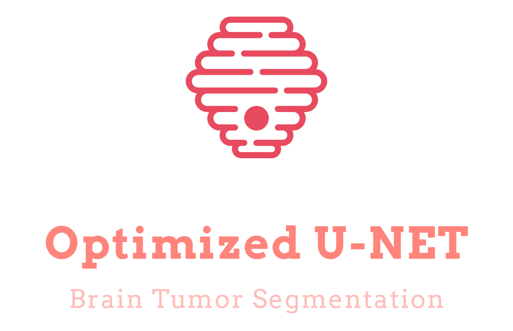
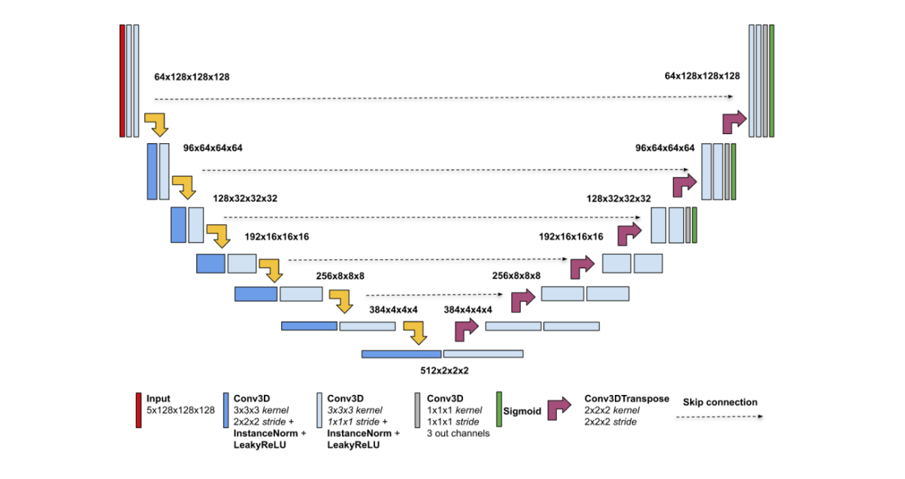

## About
This repository is the implementation of **Optimized U-Net for Brain Tumor Segmentation** paper.  
* [Paper url](https://arxiv.org/abs/2110.03352#)
* [PapersWthCode]()

# Authors
* Paper:
    * [Michal Futrega](mailto:mfutrega@nvidia.com)
    * [Alexandre Milesi](mailto:alexandrem@nvidia.com)
    * [Michal Marcinkiewicz](mailto:michalm@nvidia.com)
    * [Pablo Ribalta](mailto:pribalta@nvidia.com)

* Codebase:
    * [Milad Sadeghi DM](https://github.com/EverLookNeverSee)
    * List of [all contributors](https://github.com/EverLookNeverSee/Optimized-U-Net/graphs/contributors) to this repository

## License
This project licensed under the MIT License - see the [LICENSE](LICENSE) file for more details.
